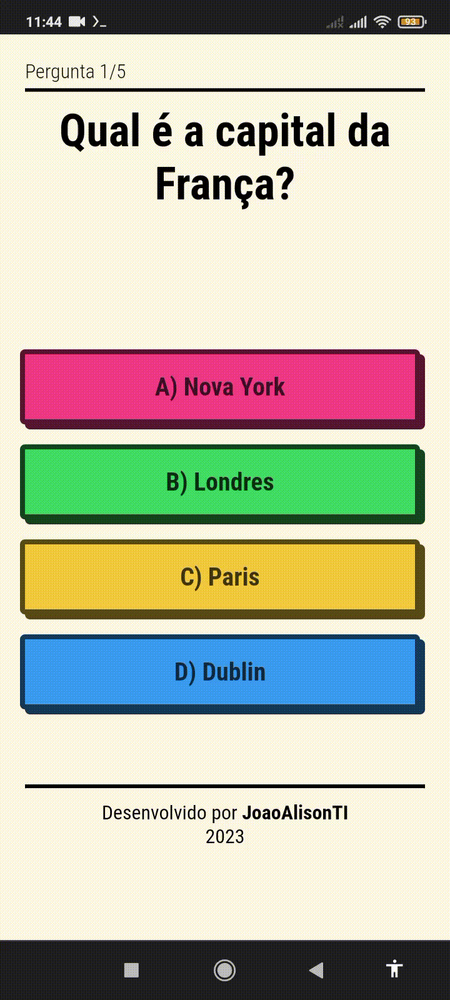

<h2 align="center"> Quiz App Desenvolvido com Vite e React </h2>

Desenvolvido durante o mês de julho de 2023 com foco no aprendizado do React. Lá estava eu na tela inical do Google Chrome quando de repente me deparo com o artigo "How to Build a Quiz App Using React –with Tips and Starter Code" da plataforma freeCodecamp, então pensei 🤔 porque não tentar fazer esse projetinho? Por mais "simples" que possa parecer, é com projetos como esse onde aprendemos bastante coisa, principalmente da base, que servem para criar futuros projetos um pouco mais robustos. 

- [Overview](#overview)
  - [Sobre o projeto](#sobre)
  - [Screenshots](#screenshots)
  - [Links](#links)
- [My process](#my-process)
  - [Desenvolvido com](#tecnologias)
  - [Continuar o desenvolvimento](#continuar-o-desenvolvimento)
  - [Recursos úteis](#recursos-úteis)
- [Author](#autor)

 

## Overview
### Sobre
O quiz basicamente tem um array de objetos das questões e respostas que são exibidos de forma dinâmica na tela. Uma das propriedades tem como valor um array de objetos, e um desses objetos tem uma propriedade com valor booleano para identificar qual é a resposta correta, "isCorret: true/false". Avança para a próxima pergunta depois de selecionar/clicar a resposta, isso ativa a função handleAnswerButtonClick que faz a soma da pontuação e faz avançar para a próxima pergunta. No topo temos um contador do total de Perguntas, ao final é mostrado o resultado do usuário, ou seja, quantas respostas certas/erradas ele obteve juntamente com uma mensagem (Dependendo da quantidade de acertos). Essa última funcionalidade não tinha no quiz mas achei interessante adicionar.
Hooks, arte do figma...Falar mais

### Screenshots

  

  

### Links
- [Acesse o projeto finalizado, online ☁️](https://quizz-application.vercel.app/)

 

## My process
### Tecnologias
### ⚙️👨‍💻
Esse projeto foi desenvolvido com as seguintes tecnologias:

- Vite
- React
- Hooks (useState...)
- Jsx
- Git e Github

### Continuar o desenvolvimento
Pretendo adicionar um Rank futuramente com o nome dos usuários

### Recursos úteis
- [Guia completo de flexbox](https://origamid.com/projetos/flexbox-guia-completo/) - Aprenda a utilizar o flexbox para a criação de layouts responsivos com css.
- [Conceitos básicos de flexbox](https://developer.mozilla.org/pt-BR/docs/Web/CSS/CSS_Flexible_Box_Layout/Basic_Concepts_of_Flexbox) - Este artigo fornece um resumo das principais funcionalidades do flexbox.
- [Learn CRUD Operations in JavaScript by Building TODO APP](https://www.freecodecamp.org/news/learn-crud-operations-in-javascript-by-building-todo-app/) - CRUD é um tipo de mecanismo que permite criar dados, ler dados, editá-los e excluí-los. Neste caso vai ser abordado sobre um app Todo, mas como também utiliza as 4 operações CRUD ele também se torna importante para entender os seus princípios.

 

## Autor
*João Alison TI 👨🏽‍💻*

---

<strong>2023</strong>